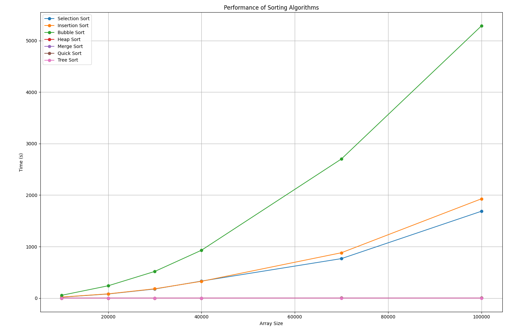

# sorting-algorithms-complexity-chart
A project comparing the execution time of different sorting algorithms on various array sizes. To create the visualization, it is using Matplotlib and Pandas libraries.

